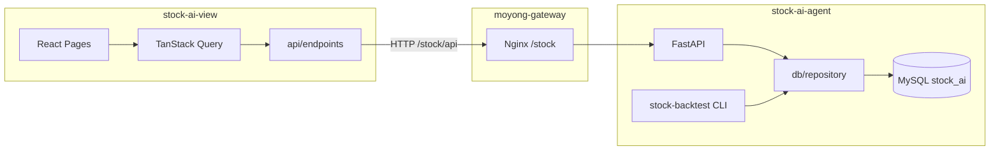

# 架构说明

## 总览



- **写入 / 同步**：仅 CLI（`db-sync`）与定时任务。
- **读取 / 展示**：前端 → `moyong-gateway` `/stock/api` → FastAPI → `MarketRepository` / `DivergenceRepository`。

---

## FastAPI 路由

| 方法 | 路径 | 模块 | 说明 |
|------|------|------|------|
| GET | `/api/health` | `routers/health.py` | DB 连通性 |
| GET | `/api/screen/divergence` | `routers/screen.py` | 背离筛选（对齐 `screen --from-db`） |
| GET | `/api/stocks/{code}/daily` | `routers/stocks.py` | 日 K OHLCV |
| GET | `/api/stocks/{code}/indicators` | `routers/stocks.py` | MACD / RSI 等 |
| GET | `/api/stocks/{code}/divergence` | `routers/stocks.py` | 单股背离事件 |
| GET | `/api/sync/summary` | `routers/sync.py` | `sync_meta` 按 status 统计 |
| GET | `/api/sync/failures` | `routers/sync.py` | 失败原因 Top N |
| GET | `/api/sync/failed` | `routers/sync.py` | 失败列表分页 |
| GET | `/api/backtest/run` | `routers/backtest.py` | 相似走势历史回测（库内日 K；筹码读 `stock_chip`） |

实现位置：`stock-ai-agent/src/stock_ai_agent/api/`。

启动：

```bash
cd /Applications/MAMP/nears/stock-ai-agent
source .venv/bin/activate
pip install -e ".[api]"
stock-api
```

环境变量（可选）：`API_HOST`、`API_PORT`、`API_CORS_ORIGINS`、`API_RELOAD`。

---

## 前端目录结构

```
stock-ai-view/
├── docs/
│   ├── frontend-handoff.md   # 表结构与产品说明
│   └── architecture.md       # 本文件
├── public/
├── src/
│   ├── api/
│   │   ├── client.ts         # fetch 封装、ApiError
│   │   ├── types.ts          # 与 API 对齐的 TS 类型
│   │   └── endpoints/        # 按域拆分：divergence / stocks / sync
│   ├── components/
│   │   ├── layout/           # AppLayout、导航
│   │   └── charts/           # StockKlineChart（ECharts）
│   ├── pages/
│   │   ├── DivergenceListPage.tsx
│   │   ├── StockDetailPage.tsx
│   │   └── SyncStatusPage.tsx
│   ├── routes/index.tsx      # react-router 配置
│   ├── lib/queryClient.ts
│   ├── main.tsx
│   └── index.css
├── vite.config.ts            # @ 别名、/api 代理
└── package.json
```

### 路由与页面

| 路径 | 页面 | 主要 API |
|------|------|----------|
| `/` | 背离列表 | `GET /api/screen/divergence` |
| `/stock/:code` | 单股 K 线 + MACD | `daily` + `indicators` + `divergence` |
| `/sync` | 同步状态 | `summary` + `failures` + `failed` |

### 后续扩展（Tauri / 功能）

| 目录（建议） | 用途 |
|--------------|------|
| `src/hooks/` | 复用查询与筛选状态 |
| `src/components/tables/` | 背离表列配置 |
| `src-tauri/` | Tauri 2 壳，复用 `src/` |
| `POST /api/sync/trigger` | 鉴权后触发 CLI 补数 |

---

## 类型与字段约定

- JSON 字段：**snake_case**，与 MySQL 列名一致。
- 日期：`YYYY-MM-DD`；日期时间：ISO 8601。
- 周期 `timeframe`：`daily` | `weekly` | `monthly` | `half_year` | `yearly`。
- 背离 `kind`：`top` | `bottom`。
- 筹码：表 `stock_chip`，由库内日 K + 换手率本地递推（`db-sync-chips` 或同步时 `--with-chips`）。
- 换手率：`stock_daily.turnover_rate`（%），`db-sync` / `db-sync-single-day` 同步日 K 时写入；历史补全用 `db-sync-turnover`。
